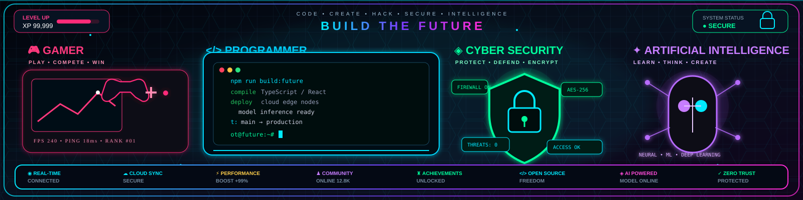

# Hi there, I'm Srengsophea 👋

<!-- Animated header: header.svg (committed to repo root) -->

---

## 👩‍💻 About Me
- Frontend-focused developer building interactive, accessible UIs and lightweight full-stack tools.
- Currently working on: [inventory-stock](https://github.com/Srengsophea/inventory-stock)
- Learning: TypeScript, Cloud Architecture
- Location: Cambodia

## 💻 Tech & Tools

---

## 🚀 Featured Projects
I picked a few repos from your account that showcase different skills. Replace or reorder these if you'd like different highlights.

- **inventory-stock** · [Repo](https://github.com/Srengsophea/inventory-stock)
  - TypeScript project for managing inventory (you listed this as current work).

- **portfolio** · [Repo](https://github.com/Srengsophea/portfolio)
  - Portfolio website — a clean place to show demos and live sites.

- **khmer-news** · [Repo](https://github.com/Srengsophea/khmer-news)
  - News website built with EJS templates — demonstrates full-stack templating.

- **Clarity-Analytics** · [Repo](https://github.com/Srengsophea/Clarity-Analytics)
  - Static/HTML analytics UI — useful to show dashboard UI work.

(See all repos: https://github.com/Srengsophea?tab=repositories)

---

## 📫 Get in Touch
- Email: khsophea20@gmail.com
- LinkedIn: [Add your LinkedIn URL](https://linkedin.com)
- Twitter: [Add your Twitter handle](https://twitter.com)

<!-- Footer button: displays the footer.svg as a clickable banner -->

