# Hi there, I'm Srengsophea 👋

<!-- Add an animated header image (header.svg or header.gif) to the repo root to show here -->

  
  

---

## 👩‍💻 About Me
- Frontend-focused developer building interactive, accessible UIs and lightweight full-stack tools.
- Currently working on: [inventory-stock](https://github.com/Srengsophea/inventory-stock)
- Learning: TypeScript, Cloud Architecture
- Location: Cambodia

## 💻 Tech & Tools

---

## 🚀 Featured Projects
I picked a few repos from your account that showcase different skills. Replace or reorder these if you'd like different highlights.

- **inventory-stock** · [Repo](https://github.com/Srengsophea/inventory-stock)
  - TypeScript project for managing inventory (you listed this as current work).

- **portfolio** · [Repo](https://github.com/Srengsophea/portfolio)
  - Your portfolio website (HTML) — a good place to show demos.

- **khmer-news** · [Repo](https://github.com/Srengsophea/khmer-news)
  - News website (EJS) — shows full-stack / templating work.

- **Clarity-Analytics** · [Repo](https://github.com/Srengsophea/Clarity-Analytics)
  - HTML project — good for showing analytics or dashboard UI work.

(See all repos: https://github.com/Srengsophea?tab=repositories)

---

## 📊 GitHub Stats

---

## 📫 Get in Touch
- Email: khsophea20@gmail.com
- LinkedIn: [Add your LinkedIn URL](https://linkedin.com)
- Twitter: [Add your Twitter handle](https://twitter.com)

---

## ✨ Next steps I can help with
- Create an animated SVG header (typing effect + gradient) and upload it as `header.svg`.
- Replace the project descriptions with short summaries you prefer, and add live demo links.
- Add a small project showcase grid (auto-generated from your repos) or a pinned-projects section.

If you want me to create the animated header (SVG) now, tell me preferred colors (e.g., purple/teal), and I will add it and update the README to use it.